# Nexus IQ Server GCP Reference Architecture (Single Instance)

## Deployment Profile

**Recommended for:**
- **Development and testing environments**
- **Proof of concept deployments**
- **Small to medium organizations** with up to 100 onboarded applications
- **Low to moderate scan frequency** (up to 2-3 evaluations per minute)

**System Specifications:**
- 8 vCPU / 32GB RAM (Docker containerized on GCE)
- PostgreSQL 17 Cloud SQL (ENTERPRISE_PLUS)
- Cloud Filestore persistent storage (2.5TB)
- Single instance deployment with global load balancing

## Overview
This reference architecture deploys Nexus IQ Server on Google Cloud Platform using cloud-native services (GCE with Docker, Cloud SQL, Cloud Filestore) for operational excellence and security. This single-instance deployment provides a solid foundation for development, testing, and small to medium production workloads.

**⚠️ Important**: The official `sonatype/nexus-iq-server` Docker image supports database configuration via environment variables and config.yml generation for single instances. This architecture leverages Docker for consistent deployment and easier version management.

## Scaling Options
- **Current Deployment**: Single Instance (up to 100 applications)
- **Vertical Scaling**: Increase GCE machine type (e.g., e2-standard-16 for 16 vCPU, 64GB RAM)
- **Database Scaling**: Enable REGIONAL availability for multi-zone deployment
- **Storage Scaling**: Upgrade from BASIC_SSD to HIGH_SCALE_SSD for better performance

## 1. High-Level Architecture

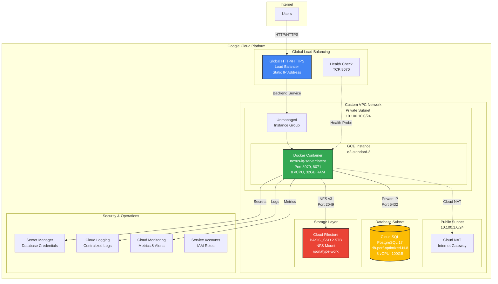

## 2. Network Flow & Security

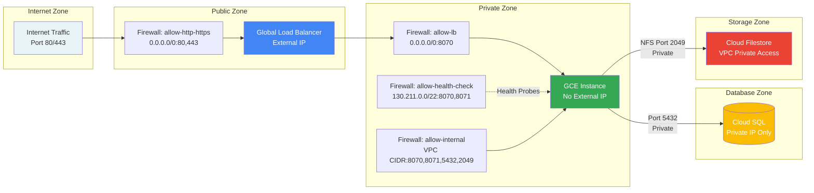

### Security Boundaries

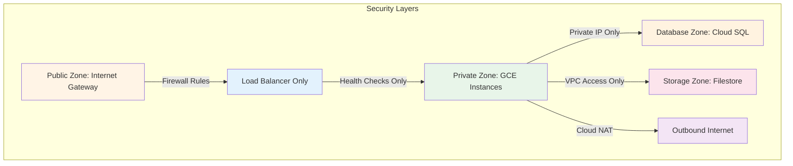

### Firewall Rules Table

| Component | Inbound | Outbound | Protocol | Source/Destination |
|-----------|---------|----------|----------|-------------------|
| Load Balancer | Internet:80,443 | GCE:8070 | HTTP | 0.0.0.0/0 |
| GCE Instance | LB:8070 | SQL:5432 | TCP | VPC CIDR |
| GCE Instance | Health:8070,8071 | Filestore:2049 | TCP/NFS | GCP Health Check IPs |
| Cloud SQL | GCE:5432 | None | PostgreSQL | Private Subnet |
| Cloud Filestore | GCE:2049 | None | NFS | Private Subnet |

## 3. Component Architecture

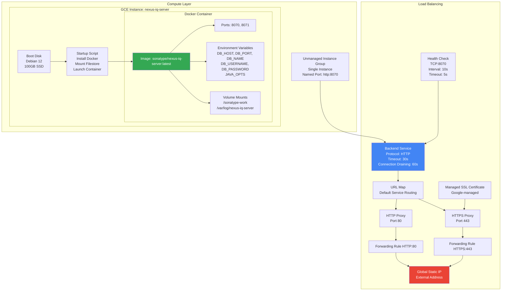

### Docker Container Startup Flow

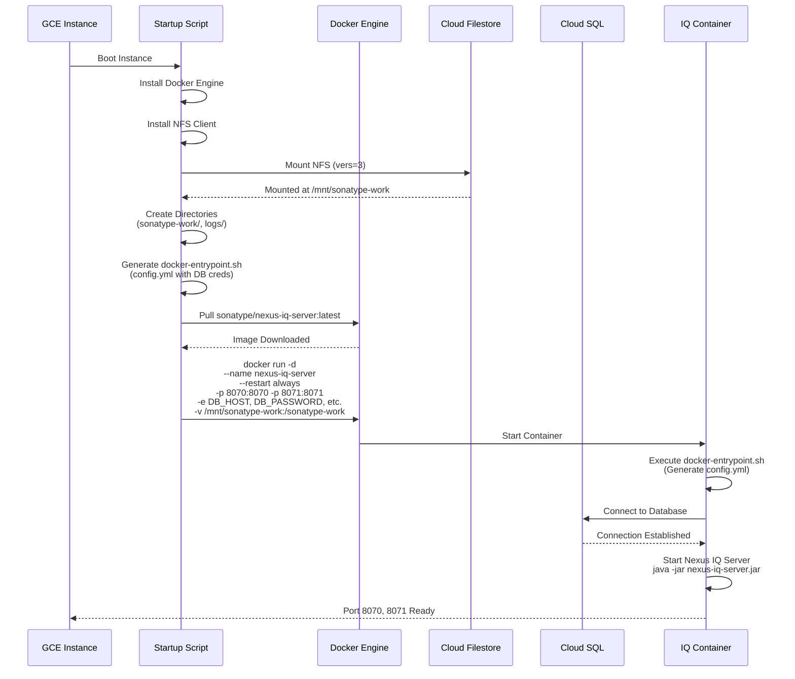

## 4. Data Persistence

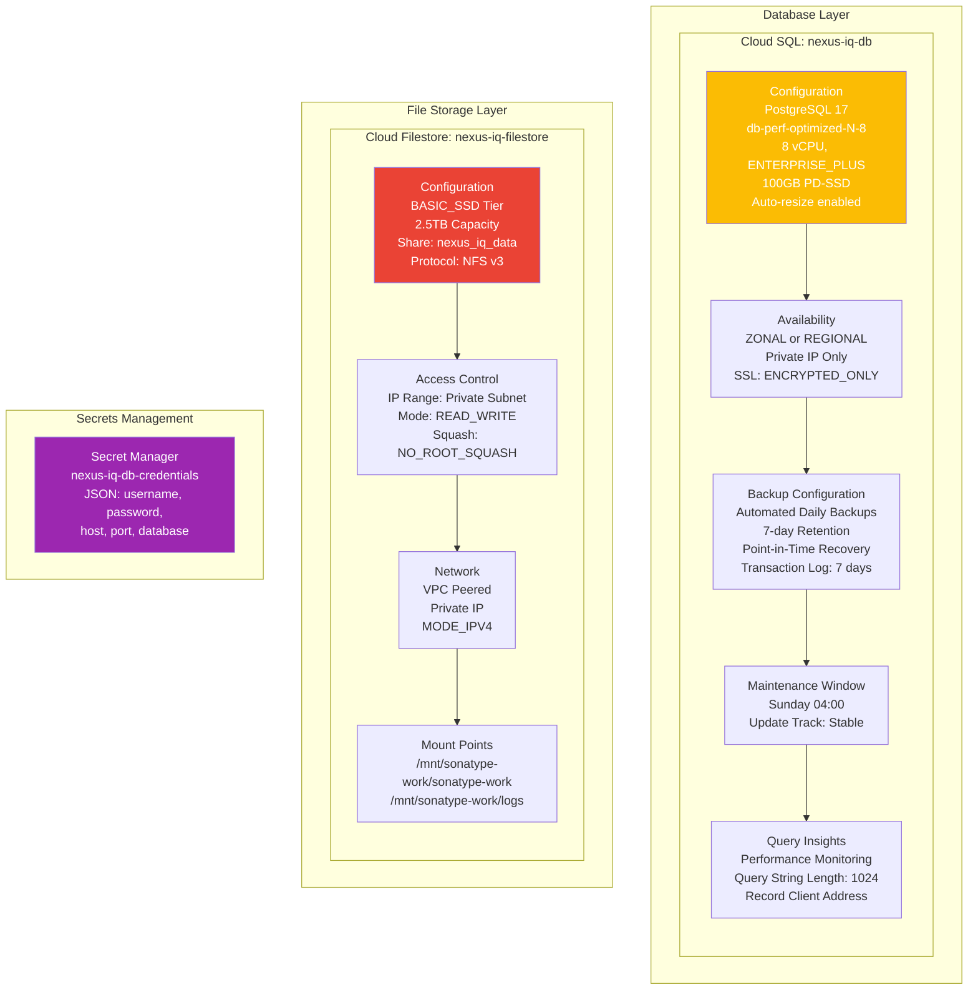

### Storage Allocation

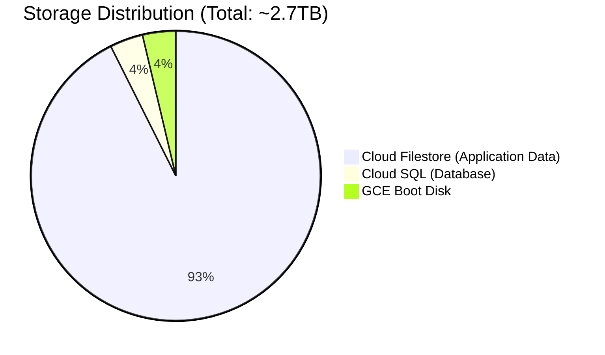

## 5. Operational Excellence

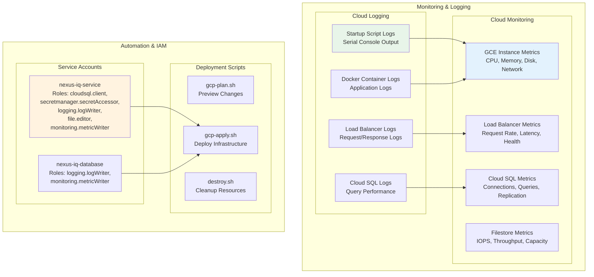

### Disaster Recovery Strategy

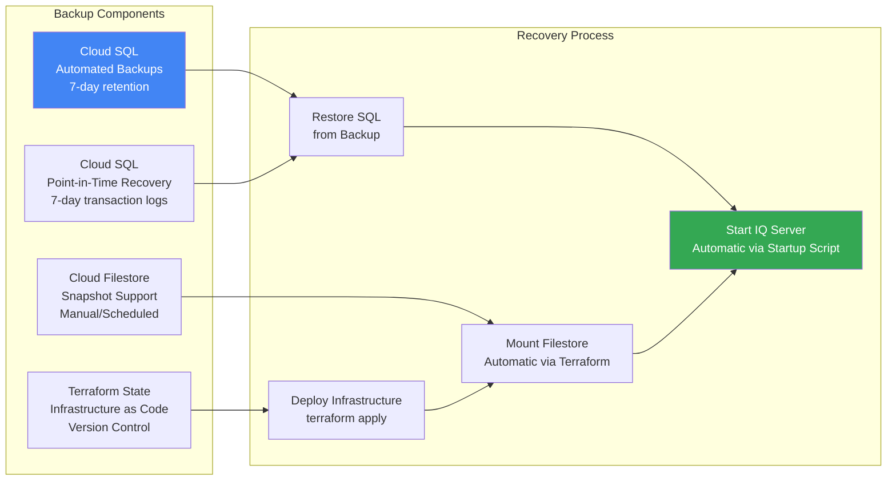

## 6. Resource Naming Convention

All resources use the prefix `ref-arch-iq-` or `nexus-iq-` for easy identification:

| Component | Resource Name | Purpose |
|-----------|---------------|---------|
| **Networking** |
| VPC | `ref-arch-iq-vpc` | Isolated network environment |
| Public Subnet | `ref-arch-iq-public-subnet` | Load balancer placement |
| Private Subnet | `ref-arch-iq-private-subnet` | GCE instances |
| Database Subnet | `ref-arch-iq-db-subnet` | Cloud SQL isolation |
| Cloud Router | `ref-arch-iq-router` | Cloud NAT routing |
| Cloud NAT | `ref-arch-iq-nat` | Outbound internet access |
| **Compute** |
| GCE Instance | `nexus-iq-server` | Docker host |
| Instance Group | `nexus-iq-instance-group` | Load balancer backend |
| Machine Type | `e2-standard-8` | 8 vCPU, 32GB RAM |
| **Load Balancing** |
| Global IP | `nexus-iq-lb-ip` | Static external IP |
| Backend Service | `nexus-iq-backend` | Traffic distribution |
| Health Check | `nexus-iq-lb-health-check` | TCP probe on port 8070 |
| URL Map | `nexus-iq-url-map` | Request routing |
| HTTP Proxy | `nexus-iq-http-proxy` | HTTP traffic handling |
| HTTPS Proxy | `nexus-iq-https-proxy` | HTTPS traffic handling |
| Forwarding Rule HTTP | `nexus-iq-http-forwarding-rule` | Port 80 forwarding |
| Forwarding Rule HTTPS | `nexus-iq-https-forwarding-rule` | Port 443 forwarding |
| SSL Certificate | `nexus-iq-ssl-cert` | Managed SSL certificate |
| **Storage** |
| Cloud SQL Instance | `nexus-iq-db-<random>` | PostgreSQL database |
| Database | `nexusiq` | Application database |
| Filestore Instance | `nexus-iq-filestore` | NFS shared storage |
| File Share | `nexus_iq_data` | Shared data volume |
| **Security** |
| Service Account (IQ) | `nexus-iq-service` | GCE instance identity |
| Service Account (DB) | `nexus-iq-database` | Database operations |
| Secret | `nexus-iq-db-credentials` | Database credentials |
| Firewall Rules | `nexus-iq-*`, `allow-*` | Network access control |

## 7. Docker Container Architecture

```mermaid
graph TD
    subgraph "Docker Container: sonatype/nexus-iq-server:latest"
        subgraph "Container Runtime"
            ENTRYPOINT[Custom Entrypoint<br/>/docker-entrypoint.sh]
            CONFIG_GEN[Generate config.yml<br/>Substitute environment variables<br/>Database configuration]
            JAVA_APP[Start Application<br/>java -jar nexus-iq-server.jar<br/>-c /etc/nexus-iq-server/config.yml]
        end
        
        subgraph "Environment Variables"
            ENV_DB[DB_HOST, DB_PORT<br/>DB_NAME, DB_USERNAME<br/>DB_PASSWORD]
            ENV_JAVA[JAVA_OPTS<br/>-Xmx48g -Xms48g<br/>-Djava.util.prefs.userRoot]
            ENV_SECURITY[NEXUS_SECURITY_RANDOMPASSWORD=false]
        end
        
        subgraph "Volume Mounts"
            VOL_WORK[/sonatype-work<br/>← /mnt/sonatype-work/sonatype-work<br/>Application data, config, work]
            VOL_LOGS[/var/log/nexus-iq-server<br/>← /mnt/sonatype-work/logs<br/>Application logs]
        end
        
        subgraph "Exposed Ports"
            PORT_APP[Port 8070<br/>Application HTTP]
            PORT_ADMIN[Port 8071<br/>Admin HTTP]
        end
    end
    
    ENTRYPOINT --> CONFIG_GEN
    CONFIG_GEN --> JAVA_APP
    
    ENV_DB --> CONFIG_GEN
    ENV_JAVA --> JAVA_APP
    ENV_SECURITY --> JAVA_APP
    
    VOL_WORK --> JAVA_APP
    VOL_LOGS --> JAVA_APP
    
    JAVA_APP --> PORT_APP
    JAVA_APP --> PORT_ADMIN
    
    style ENTRYPOINT fill:#4285f4,color:#fff
    style JAVA_APP fill:#34a853,color:#fff
    style VOL_WORK fill:#ea4335,color:#fff
```

### Docker Container Lifecycle

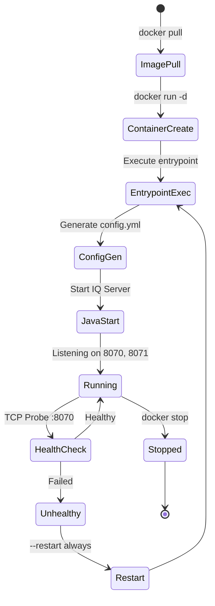

## 8. Cost Optimization

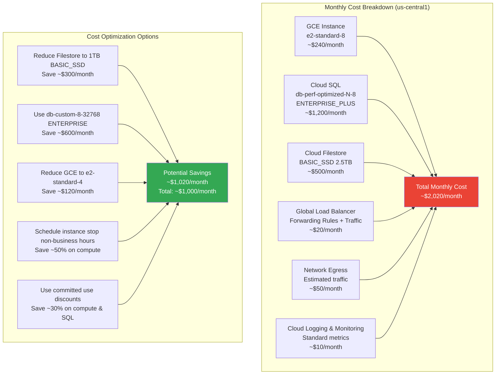

## 9. Health Check and Load Balancing Flow

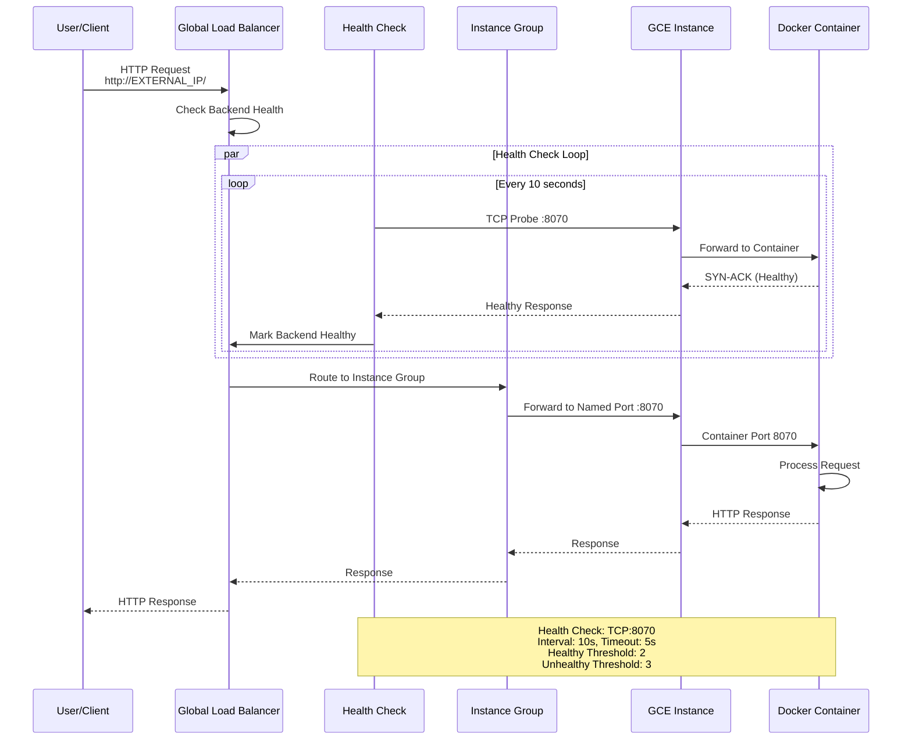

## 10. Security Architecture

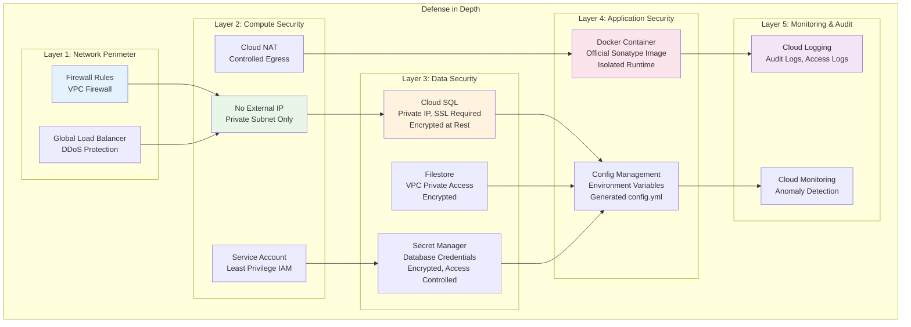

### IAM Role Hierarchy

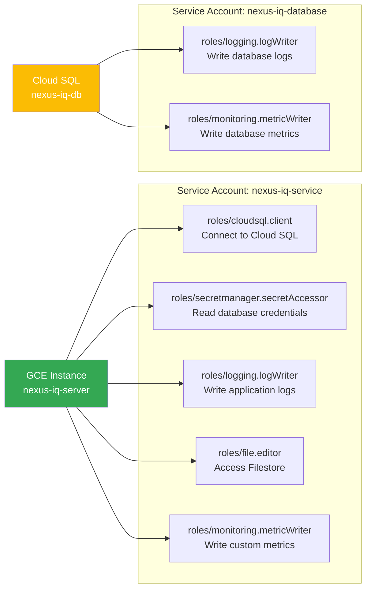

## 11. Deployment Workflow

```mermaid
graph TD
    START[Start Deployment] --> INIT[terraform init]
    INIT --> PLAN[terraform plan<br/>Review changes]
    PLAN --> APPLY[terraform apply<br/>Create resources]
    
    APPLY --> API[Enable GCP APIs<br/>compute, sqladmin, file, etc.]
    API --> VPC[Create VPC & Subnets<br/>Public, Private, Database]
    VPC --> NAT[Create Cloud Router & NAT<br/>Internet gateway]
    NAT --> FW[Create Firewall Rules<br/>allow-internal, allow-ssh, etc.]
    FW --> SA[Create Service Accounts<br/>nexus-iq-service, nexus-iq-database]
    SA --> IAM[Assign IAM Roles<br/>cloudsql.client, secretmanager.accesseor, etc.]
    IAM --> FS[Create Cloud Filestore<br/>BASIC_SSD 2.5TB NFS share]
    FS --> SQL[Create Cloud SQL<br/>PostgreSQL 17 ENTERPRISE_PLUS]
    SQL --> SM[Store Credentials in Secret Manager<br/>nexus-iq-db-credentials]
    SM --> GCE[Create GCE Instance<br/>e2-standard-8 Debian 12]
    GCE --> STARTUP[Execute Startup Script<br/>Install Docker, Mount Filestore, Launch Container]
    STARTUP --> DOCKER[Docker Container Running<br/>nexus-iq-server:latest]
    DOCKER --> IG[Create Instance Group<br/>Add GCE instance]
    IG --> HEALTH[Create Health Check<br/>TCP:8070]
    HEALTH --> BACKEND[Create Backend Service<br/>Add instance group]
    BACKEND --> LB[Create Load Balancer<br/>Global IP, URL Map, Proxies, Forwarding Rules]
    LB --> SSL{SSL Enabled?}
    SSL -->|Yes| CERT[Create Managed SSL Certificate<br/>domain_name]
    SSL -->|No| READY[Deployment Complete]
    CERT --> READY
    
    READY --> OUTPUT[terraform output<br/>load_balancer_ip, nexus_iq_url]
    OUTPUT --> ACCESS[Access Nexus IQ Server<br/>http://EXTERNAL_IP<br/>admin/admin123]
    
    style START fill:#4285f4,color:#fff
    style DOCKER fill:#34a853,color:#fff
    style READY fill:#ea4335,color:#fff
    style ACCESS fill:#fbbc04,color:#fff
```

## 12. Version Management & Updates

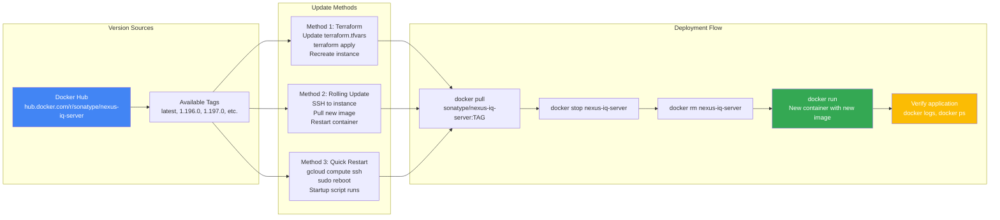

## Summary

This GCP reference architecture provides:

- **Cloud-Native Design**: Leveraging GCE with Docker, Cloud SQL, and Cloud Filestore
- **Security Best Practices**: VPC isolation, private networking, IAM roles, Secret Manager
- **Operational Excellence**: Cloud Logging, Cloud Monitoring, automated backups
- **Cost Optimization**: Right-sized resources, flexible scaling options
- **Reliability**: Health checks, automated backups, disaster recovery

**This single-instance Docker-based architecture delivers excellent performance, security, and operational efficiency for Nexus IQ Server deployments on Google Cloud Platform.**
