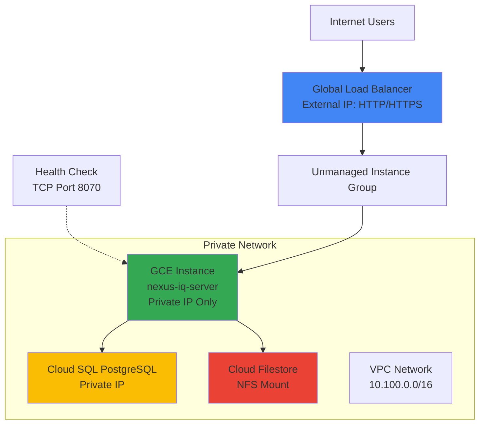

# Nexus IQ Server - GCP Cloud Native Infrastructure

This repository contains Terraform infrastructure code to deploy Sonatype Nexus IQ Server on Google Cloud Platform using cloud-native services. The infrastructure provides a robust single-instance deployment optimized for performance and cost-effectiveness.

## 🏗️ Architecture Overview

This infrastructure deploys Nexus IQ Server on GCP using a single-instance architecture with cloud-native managed services:

- **Compute Engine (GCE)** - Single VM instance running Nexus IQ Server
- **Cloud SQL PostgreSQL** (replaces RDS) - Managed database with backup and recovery
- **Cloud Filestore** (replaces EFS) - Managed NFS for persistent storage
- **Global Load Balancer** (replaces ALB) - Global load balancing with SSL
- **Cloud Monitoring & Logging** - Comprehensive observability

### Architecture Diagram



## 📋 Prerequisites

### Required Tools
- **Terraform** >= 1.0
- **gcloud CLI** - Google Cloud SDK
- **jq** - JSON processor
- **curl** - HTTP client

### GCP Requirements
- GCP Project with billing enabled
- Required APIs will be enabled automatically
- Appropriate IAM permissions for resource creation

### Installation Commands
```bash
# Install Terraform (macOS)
brew install terraform

# Install gcloud CLI
curl https://sdk.cloud.google.com | bash

# Install jq
brew install jq  # macOS
sudo apt-get install jq  # Ubuntu
```

## 🚀 Quick Start

### 1. Authentication Setup
```bash
# Authenticate with GCP
gcloud auth login
gcloud config set project YOUR_PROJECT_ID

# Enable Application Default Credentials
gcloud auth application-default login
```

### 2. Configuration
```bash
cd infra-gcp

# Generate terraform.tfvars template
./deploy.sh

# Edit terraform.tfvars with your configuration
# At minimum, set:
# - gcp_project_id = "your-project-id"
# - db_password = "secure-password-12-chars-minimum"
```

### 3. Deploy Infrastructure
```bash
# Deploy single-instance configuration
./deploy.sh --project your-project-id

```

### 4. Access Nexus IQ Server
After deployment completes (15-20 minutes), access Nexus IQ Server via the provided URL.

## 📁 File Structure

```
infra-gcp/
├── main.tf              # Core VPC and networking
├── compute.tf           # GCE instance and instance group
├── database.tf          # Cloud SQL PostgreSQL
├── storage.tf           # Cloud Filestore and Storage
├── load_balancer.tf     # Global Load Balancer
├── iam.tf              # Service accounts and IAM
├── security.tf         # Firewall and security policies
├── monitoring.tf       # Logging and monitoring
├── variables.tf        # Input variables
├── outputs.tf          # Output values
├── deploy.sh           # Main deployment script
├── destroy.sh          # Infrastructure cleanup script
├── gcp-plan.sh         # Terraform plan helper
├── gcp-apply.sh        # Terraform apply helper
├── scripts/
│   └── startup.sh      # GCE instance startup script
└── docs/               # Documentation
    ├── ARCHITECTURE.md
    ├── SECURITY.md
    └── MONITORING.md
```

## ⚙️ Configuration Options

### Basic Configuration (terraform.tfvars)
```hcl
# Required Settings
gcp_project_id = "your-gcp-project-id"
gcp_region     = "us-central1"
db_password    = "secure-password-12-chars-minimum"

# Optional Settings
environment    = "dev"        # dev, staging, prod
enable_ssl     = true         # Enable HTTPS
domain_name    = ""           # Custom domain for SSL

# Instance Configuration
gce_machine_type = "n1-standard-2"  # 2 vCPU, 7.5GB RAM
iq_version       = "1.196.0-01"     # Nexus IQ Server version
java_opts        = "-Xms2g -Xmx4g" # JVM memory settings

# Security Configuration
enable_cloud_armor = true
blocked_countries  = ["CN", "RU"]  # Optional country blocking
admin_users       = ["user:admin@example.com"]

# Monitoring Configuration
enable_monitoring_alerts = true
alert_email_addresses   = ["admin@example.com"]
```


## 🔧 Deployment Scripts

### Main Deployment Script
```bash
./deploy.sh [OPTIONS]

Options:
  -h, --help              Show help message
  -p, --project PROJECT   GCP Project ID
  -s, --state-bucket BUCKET  Remote state bucket
  -d, --dry-run              Plan only (no deployment)
  -f, --force-destroy        Auto-destroy on failure
  -v, --verbose              Enable verbose logging

Examples:
  ./deploy.sh --project my-project
  ./deploy.sh --project my-project --dry-run
```

### Infrastructure Cleanup
```bash
./destroy.sh [OPTIONS]

Options:
  -h, --help              Show help message
  -f, --force             Force destroy protected resources
  -d, --dry-run           Show destroy plan only
  -y, --yes               Skip confirmation prompts
  --no-backup             Skip data backup
  --preserve-state        Keep Terraform files

Examples:
  ./destroy.sh                    # Safe destruction
  ./destroy.sh --dry-run          # Show what would be destroyed
  ./destroy.sh --force --yes      # Force destroy (dangerous!)
```

### Helper Scripts
```bash
# Plan changes
./gcp-plan.sh [--detailed] [--validate-only]

# Apply saved plan
./gcp-apply.sh [--auto-approve] [--quiet]
```

## 🌐 Network Architecture

### VPC Configuration
- **VPC CIDR**: 10.100.0.0/16
- **Private Subnet**: 10.100.10.0/24 (GCE Instance)
- **Database Subnet**: 10.100.20.0/24 (Cloud SQL)

### Firewall Rules
- **Load Balancer Health Checks**: Allows TCP 8070, 8071 from GCP health check ranges (130.211.0.0/22, 35.191.0.0/16)
- **SSH Access**: Allows SSH from authorized IPs (optional)
- **Database**: Allows PostgreSQL from private subnet only
- **Internal**: Allows communication within VPC

## 🗄️ Data Storage

### Database (Cloud SQL PostgreSQL)
- **Instance**: db-custom-2-7680 (2 vCPU, 7.5GB RAM)
- **Storage**: 100GB SSD (auto-expand to 1TB)
- **Backups**: Daily automated backups, 7-day retention
- **Security**: Private IP only, SSL required, encryption at rest
- **Network**: Connected via VPC peering for private access

### File Storage (Cloud Filestore)
- **Single Instance**: BASIC_SSD, 1TB capacity
- **Mount Path**: /nexus_iq_data
- **Access**: NFS v3, private network only

### Object Storage (Cloud Storage)
- **Backup Bucket**: Application data backups
- **Logs Bucket**: Application and system logs
- **Config Bucket**: Configuration backups
- **Security**: Encryption with KMS keys, lifecycle policies

## 🔒 Security Features

### Network Security
- Private VPC with controlled access
- VPC firewall rules (stateful)
- Cloud Armor WAF with OWASP rules
- DDoS protection and rate limiting

### Data Security
- Encryption at rest with KMS keys
- Encryption in transit (TLS 1.2+)
- Secret Manager for credentials
- IAM service accounts with minimal permissions

### Access Control
- Identity-Aware Proxy (optional)
- Binary Authorization for containers
- Regular security scanning
- Audit logging enabled

## 📊 Monitoring & Alerting

### Built-in Dashboards
- Cloud Run performance metrics
- Database performance and connections
- Load balancer request metrics
- Error rates and latencies

### Alert Policies
- High CPU utilization (>80%)
- High memory usage (>80%)
- Error rate threshold breaches
- Database connection limits
- Service availability (uptime checks)

### Logging
- Centralized logging with Cloud Logging
- Log retention policies
- Security event logging
- Audit trail for all changes

## 🔄 Performance & Scaling

### Single Instance Architecture
- **Instance Type**: n1-standard-2 (2 vCPU, 7.5GB RAM)
- **Scaling**: Vertical scaling by changing machine type
- **High Availability**: Manual failover with instance snapshots
- **Backup Strategy**: Automated snapshots and SQL backups

### Load Balancer Health Checks
- **Protocol**: TCP health check on port 8070
- **Interval**: 10 seconds
- **Timeout**: 5 seconds
- **Healthy Threshold**: 2 consecutive successes
- **Unhealthy Threshold**: 3 consecutive failures

### Database Performance
- **Connection pooling**: Built-in PostgreSQL pooling
- **Performance Insights**: Query performance monitoring
- **Automatic storage scaling**: 100GB to 1TB+

## 🆘 Troubleshooting

### Common Issues

#### Service Not Responding
```bash
# Check instance status
gcloud compute instances describe nexus-iq-server --zone=us-central1-a

# Check backend health
gcloud compute backend-services get-health nexus-iq-backend --global

# Check instance logs
gcloud compute instances get-serial-port-output nexus-iq-server --zone=us-central1-a

# SSH to instance (if configured)
gcloud compute ssh nexus-iq-server --zone=us-central1-a

# Check service status on instance
sudo systemctl status nexus-iq

# Check database connectivity
gcloud sql instances describe $(terraform output -raw database_instance_name)
```

#### SSL Certificate Issues
```bash
# Check certificate status
gcloud compute ssl-certificates describe nexus-iq-ssl-cert

# Domain verification
dig $(terraform output -raw domain_name)
```

#### High Costs
```bash
# Check resource usage
gcloud billing budgets list
gcloud monitoring dashboards list

# Optimize resources
# - Reduce instance sizes
# - Adjust storage tiers
```

### Log Locations
- **Deployment logs**: `deploy.log`, `destroy.log`
- **Terraform logs**: `plan.log`, `apply.log`
- **Application logs**: Cloud Logging console
- **System logs**: Cloud Monitoring console

## 🔧 Maintenance

### Regular Tasks
1. **Monitor costs** - Review billing dashboard monthly
2. **Update images** - Update Nexus IQ Server container image
3. **Review logs** - Check for errors and performance issues
4. **Security updates** - Keep Terraform and providers updated
5. **Backup verification** - Test restore procedures quarterly

### Updating Infrastructure
```bash
# Update Terraform configuration
vi terraform.tfvars

# Plan changes
./gcp-plan.sh --detailed

# Apply changes
./gcp-apply.sh
```

### Scaling Operations
```bash
# Vertical scaling - increase machine type
# Edit terraform.tfvars:
echo 'gce_machine_type = "n1-standard-4"' >> terraform.tfvars
./gcp-apply.sh

# Vertical scaling - increase JVM memory
echo 'java_opts = "-Xms4g -Xmx8g"' >> terraform.tfvars
./gcp-apply.sh

# For horizontal scaling, consider the HA architecture in infra-gcp-ha/
```

## 📚 Additional Resources

- [Architecture Documentation](docs/ARCHITECTURE.md)
- [Security Guide](docs/SECURITY.md)
- [Monitoring Guide](docs/MONITORING.md)
- [Nexus IQ Server Documentation](https://help.sonatype.com/iqserver)
- [Google Cloud Documentation](https://cloud.google.com/docs)

## 🤝 Support

### Getting Help
1. Check this documentation and troubleshooting guide
2. Review logs in Cloud Logging console
3. Check GCP status page for service issues
4. Contact your DevOps team or GCP support

### Reporting Issues
When reporting issues, include:
- Terraform version and configuration
- Error messages from logs
- GCP project ID and region
- Steps to reproduce the issue

## 📄 License

This infrastructure code is provided as-is for reference architecture purposes. Ensure compliance with your organization's policies and Sonatype's licensing terms.

---

**⚠️ Important**: Always test in a non-production environment first. Review costs and security implications before deploying to production.