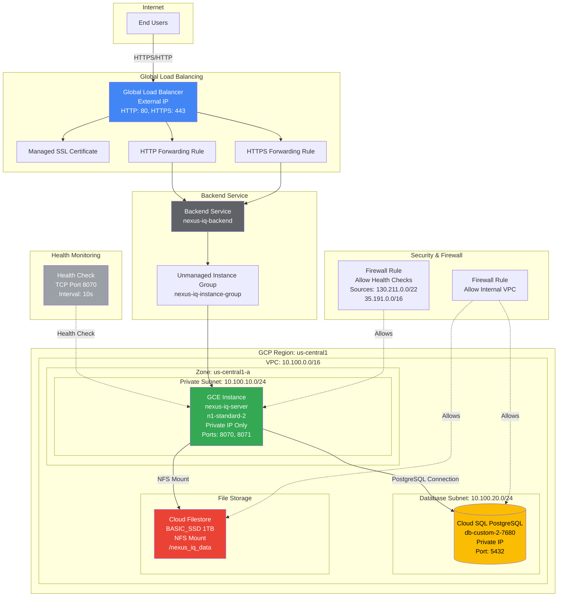
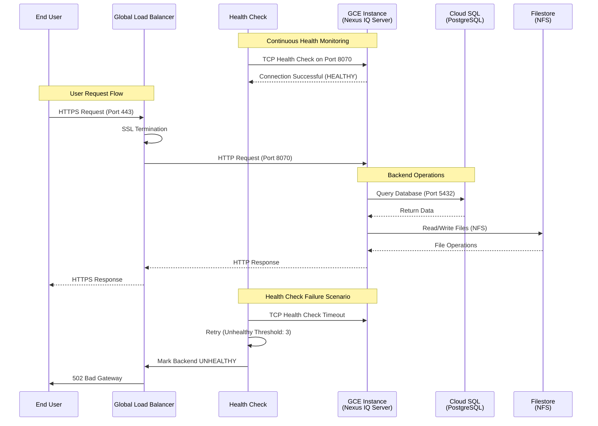
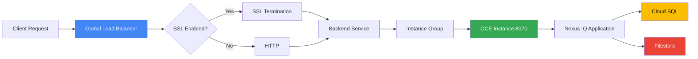
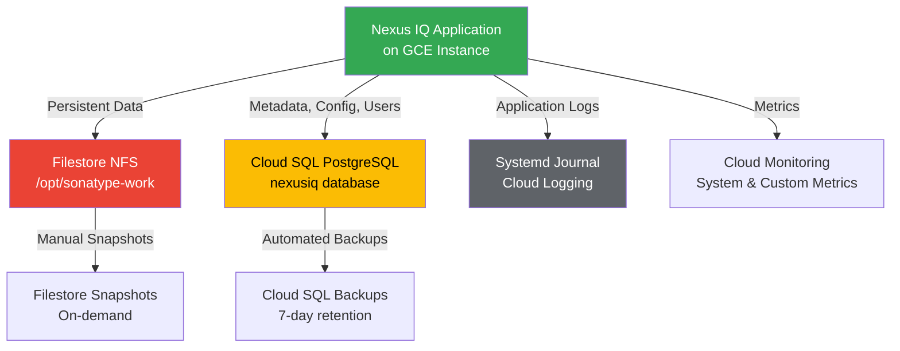

# Nexus IQ Server - GCP Single Instance Architecture Guide

This document provides a detailed technical architecture overview of the single-instance Nexus IQ Server deployment on Google Cloud Platform.

## 📐 Architecture Overview

### High-Level Architecture Diagram



### Network Flow Diagram



## 🏗️ Component Architecture

### 1. Frontend Layer

#### Global Load Balancer
- **Type**: HTTP(S) Load Balancer with global anycast IP
- **Components**:
  - Global forwarding rules (HTTP: 80, HTTPS: 443)
  - Target HTTP/HTTPS proxies
  - URL map for routing
  - Backend service with instance group
- **Features**:
  - SSL/TLS termination with managed certificates (optional)
  - HTTP to HTTPS redirect (when SSL enabled)
  - Global traffic distribution
  - Connection draining (60s timeout)
- **Backend**: Unmanaged instance group with single GCE instance

#### Health Check Configuration
- **Type**: TCP health check (port 8070)
- **Why TCP**: 
  - Root path "/" returns 303 redirect, not 200 OK
  - GCP doesn't support custom HTTP response code matching
  - TCP check validates port is listening and responsive
- **Settings**:
  - Check Interval: 10 seconds
  - Timeout: 5 seconds
  - Healthy Threshold: 2 consecutive successes
  - Unhealthy Threshold: 3 consecutive failures

### 2. Compute Layer

#### GCE Instance Configuration

##### Production Configuration
```yaml
Instance Name: nexus-iq-server
Machine Type: n1-standard-2 (2 vCPU, 7.5GB RAM)
Zone: us-central1-a
Boot Disk:
  Image: ubuntu-2204-lts
  Type: pd-ssd
  Size: 50GB

Networking:
  Network: nexus-iq-vpc
  Subnet: nexus-iq-private-subnet (10.100.10.0/24)
  External IP: None (private only)
  Internal IP: Dynamic (private)
  Tags: [nexus-iq-server, allow-health-check]

Ports:
  - 8070 (Application HTTP)
  - 8071 (Admin/Health Check)
```

#### Application Installation (Startup Script)
```bash
Nexus IQ Server Installation:
  Version: 1.196.0-01
  Install Path: /opt/nexus-iq-server-{version}
  JAR File: nexus-iq-server-{version}.jar
  Config: /etc/nexus-iq-server/config.yml
  
Java Configuration:
  JAVA_OPTS: -Xms2g -Xmx4g
  JVM Args: --add-opens flags for Java 17+ compatibility
  
Systemd Service:
  Service Name: nexus-iq
  User: nexus-iq
  Auto-start: enabled
  
Database Connection:
  Type: PostgreSQL
  Host: Cloud SQL private IP
  Port: 5432
  Database: nexusiq
  
File Storage:
  Filestore Mount: /mnt/filestore
  Work Directory: /opt/sonatype-work
```

#### Unmanaged Instance Group
```yaml
Group Name: nexus-iq-instance-group
Zone: us-central1-a
Instances: [nexus-iq-server]
Named Ports:
  - Name: http
    Port: 8070
    
Purpose: Backend for Global Load Balancer
Type: Unmanaged (manual instance management)
```

### 3. Data Layer

#### Cloud SQL PostgreSQL

##### Production Instance
```yaml
Configuration:
  Tier: db-custom-2-7680 (2 vCPU, 7.5GB RAM)
  Storage: 100GB SSD, auto-expand to 1TB
  Availability: Zonal with automated backups
  
Networking:
  Type: Private IP only
  VPC: nexus-iq-vpc
  SSL: Required
  
Backup:
  Schedule: Daily at 03:00 UTC
  Retention: 7 days
  Point-in-time: 7 days
```

#### Cloud Filestore (NFS)

##### Standard Configuration
```yaml
Instance: nexus-iq-filestore
Tier: BASIC_SSD
Capacity: 1TB (expandable)
Performance: 100 MB/s read/write
Network: Private VPC access only
Mount: /nexus_iq_data
```

### 4. Storage Layer

#### Cloud Storage Buckets

##### Backup Storage
```yaml
Bucket: nexus-iq-backups-{random}
Location: Regional (same as compute)
Storage Class: Standard
Lifecycle:
  - Delete after 30 days
  - Version limit: 10 versions
Encryption: Customer-managed KMS key
```

##### Log Storage
```yaml
Bucket: nexus-iq-logs-{random}
Location: Regional
Storage Class: Nearline (for cost optimization)
Lifecycle:
  - Move to Coldline after 30 days
  - Delete after 90 days
```

### 5. Network Architecture

#### VPC Design
```yaml
VPC: nexus-iq-vpc
CIDR: 10.100.0.0/16
Routing Mode: Regional
MTU: 1460

Subnets:
  Private (Compute):
    Name: nexus-iq-private-subnet
    CIDR: 10.100.10.0/24
    Region: us-central1
    Private Google Access: Enabled
    Purpose: GCE instance hosting
    
  Database:
    Name: nexus-iq-database-subnet  
    CIDR: 10.100.20.0/24
    Region: us-central1
    Private Service Connect: Enabled
    Purpose: Cloud SQL private access
```

#### Cloud NAT
```yaml
NAT Gateway: nexus-iq-nat
Router: nexus-iq-router
Region: us-central1
IP Allocation: Auto-assigned
Logging: Errors only
Purpose: Outbound internet access for private GCE instance
Use Cases:
  - Download Nexus IQ Server binary
  - Install system packages
  - Docker image pulls (if containerized)
```

### 6. Security Architecture

#### Identity & Access Management

##### Service Accounts
```yaml
Nexus IQ Service Account:
  Name: nexus-iq-service
  Roles:
    - Cloud SQL Client
    - Secret Manager Accessor
    - Storage Admin (buckets)
    - Filestore Editor
    - KMS Crypto Key Encrypter/Decrypter
    
Load Balancer Service Account:
  Name: nexus-iq-lb
  Roles:
    - Cloud Run Invoker
    - Logging Writer
```

##### Custom IAM Role
```yaml
Role: nexusIqOperator
Permissions:
  - cloudsql.instances.get/list
  - run.services.get/list
  - storage.objects.*
  - secretmanager.versions.access
  - monitoring.timeSeries.create
```

#### Encryption

##### Data at Rest
```yaml
Cloud SQL: Google-managed encryption + CMEK
Cloud Storage: Customer-managed KMS keys
Filestore: Google-managed encryption
Secrets: Automatic encryption

KMS Configuration:
  Key Ring: nexus-iq-keyring
  Keys:
    - nexus-iq-storage-key (Storage)
    - nexus-iq-database-key (Database)
  Rotation: 90 days
```

##### Data in Transit
```yaml
Client to LB: TLS 1.2+ (managed certificates)
LB to GCE: HTTP over Google backbone
GCE to SQL: TLS with SSL mode
All internal: Google's encrypted backbone
```

#### Network Security

##### Firewall Rules
```yaml
Allow Health Checks:
  Name: nexus-iq-allow-health-check
  Source Ranges: 130.211.0.0/22, 35.191.0.0/16
  Target Tags: [nexus-iq-server, allow-health-check]
  Protocols/Ports: TCP 8070, 8071
  Purpose: Allow GCP load balancer health probes
  Priority: 1000
  
Allow SSH (Optional):
  Name: nexus-iq-allow-ssh
  Source Ranges: [Authorized IPs]
  Target Tags: [nexus-iq-server]
  Protocols/Ports: TCP 22
  Purpose: Administrative access
  Priority: 1000
  
Allow Internal VPC:
  Name: nexus-iq-allow-internal
  Source Ranges: 10.100.0.0/16
  Target: All VPC resources
  Protocols/Ports: All
  Purpose: Internal VPC communication
  Priority: 65534
```

### 7. Monitoring Architecture

#### Observability Stack

##### Metrics Collection
```yaml
Sources:
  - GCE Instance: CPU, memory, disk, network metrics
  - Cloud SQL: Query performance, connections
  - Load Balancer: Request rates, latencies
  - Custom: Application-specific metrics

Storage:
  - Cloud Monitoring: Real-time metrics
  - BigQuery: Long-term analytics (optional)
```

##### Logging Pipeline
```yaml
Sources:
  - GCE Instance: Application logs, system logs
  - Cloud SQL: Query logs, error logs
  - VPC: Flow logs (optional)
  - Security: Audit logs, firewall logs

Processing:
  - Cloud Logging: Centralized collection
  - Log Router: Filtering and routing
  - Pub/Sub: Real-time processing (optional)
```

##### Alerting Framework
```yaml
Alert Policies:
  - High CPU/Memory: >80% for 5 minutes
  - Error Rate: >10 errors/minute
  - Database Connections: >150 active
  - Service Down: Failed health checks
  
Notification Channels:
  - Email: Immediate alerts
  - Slack: Team notifications
  - PagerDuty: Critical incidents
```

## 🔄 Data Flow Diagrams

### Request Flow


### Data Persistence Flow


## 🔧 Scaling Patterns

### Single Instance Architecture
This deployment uses a **single GCE instance** architecture optimized for:
- Cost efficiency
- Simplicity of management
- Small to medium workloads
- Development and testing environments

### Vertical Scaling (Primary Method)
```yaml
Machine Type Options:
  Small: n1-standard-2 (2 vCPU, 7.5GB RAM)
  Medium: n1-standard-4 (4 vCPU, 15GB RAM)
  Large: n1-standard-8 (8 vCPU, 30GB RAM)
  X-Large: n1-standard-16 (16 vCPU, 60GB RAM)
  
Java Heap Sizing:
  Small: -Xms2g -Xmx4g
  Medium: -Xms4g -Xmx8g
  Large: -Xms8g -Xmx16g
  X-Large: -Xms16g -Xmx32g

Scaling Procedure:
  1. Update gce_machine_type in terraform.tfvars
  2. Update java_opts with new heap sizes
  3. Run terraform apply
  4. Instance will be recreated with new size
  5. Downtime: ~3-5 minutes during recreation
```

### Database Scaling
```yaml
Cloud SQL Tiers:
  Small: db-custom-1-3840 (1 vCPU, 3.75GB RAM)
  Medium: db-custom-2-7680 (2 vCPU, 7.5GB RAM)
  Large: db-custom-4-15360 (4 vCPU, 15GB RAM)
  X-Large: db-custom-8-30720 (8 vCPU, 30GB RAM)
  
Storage: Auto-expand enabled (100GB to 1TB+)
Connections: Scales with vCPUs
```

### Horizontal Scaling (HA Architecture)
For horizontal scaling and high availability:
- See `../infra-gcp-ha/` for managed instance group architecture
- Features:
  - Multiple instances with auto-healing
  - Regional distribution
  - Automatic failover
  - Session persistence
  - Zero-downtime updates

## 🏛️ Compliance & Governance

### Security Compliance
- **SOC 2 Type II**: Cloud provider certifications
- **ISO 27001**: Security management standards
- **PCI DSS**: If handling payment data
- **GDPR**: Data protection compliance

### Operational Governance
- **Infrastructure as Code**: All resources defined in Terraform
- **Version Control**: Git-based configuration management
- **Change Management**: Pull request workflow
- **Audit Trail**: All changes logged and tracked

### Cost Governance
- **Resource Tagging**: Consistent labeling strategy
- **Budget Alerts**: Automated cost monitoring
- **Right-sizing**: Regular resource optimization
- **Reserved Capacity**: Committed use discounts for predictable workloads

## 🔍 Performance Characteristics

### Expected Performance
```yaml
Response Times:
  - Web Interface: <2 seconds (p95)
  - API Calls: <500ms (p95)
  - File Operations: <1 second (p95)

Throughput:
  - Concurrent Users: 10-100
  - Scans per Hour: 100-1000
  - Database QPS: 100-500

Availability:
  - Single Instance: 99.0-99.5%
  - RTO: 3-5 minutes (instance recreation)
  - RPO: <1 minute (database backups)
```

### Capacity Planning
```yaml
Small Deployment (1-10 users):
  - Instance: n1-standard-2 (2 vCPU, 7.5GB RAM)
  - Java Heap: -Xms2g -Xmx4g
  - Database: db-custom-1-3840
  - Filestore: BASIC_SSD 1TB
  - Expected Load: 100-500 scans/day

Medium Deployment (10-50 users):
  - Instance: n1-standard-4 (4 vCPU, 15GB RAM)
  - Java Heap: -Xms4g -Xmx8g
  - Database: db-custom-2-7680
  - Filestore: BASIC_SSD 2TB
  - Expected Load: 500-2000 scans/day

Large Deployment (50-100 users):
  - Instance: n1-standard-8 (8 vCPU, 30GB RAM)
  - Java Heap: -Xms8g -Xmx16g
  - Database: db-custom-4-15360
  - Filestore: BASIC_SSD 5TB
  - Expected Load: 2000-5000 scans/day

Enterprise Deployment (100+ users):
  - Recommendation: Use HA architecture (infra-gcp-ha/)
  - Multiple instances with load balancing
  - Database read replicas
  - Regional redundancy
```

This architecture provides a cost-effective, scalable foundation for running Nexus IQ Server on Google Cloud Platform, leveraging managed services for optimal performance and operational efficiency while maintaining simplicity for single-instance deployments.
